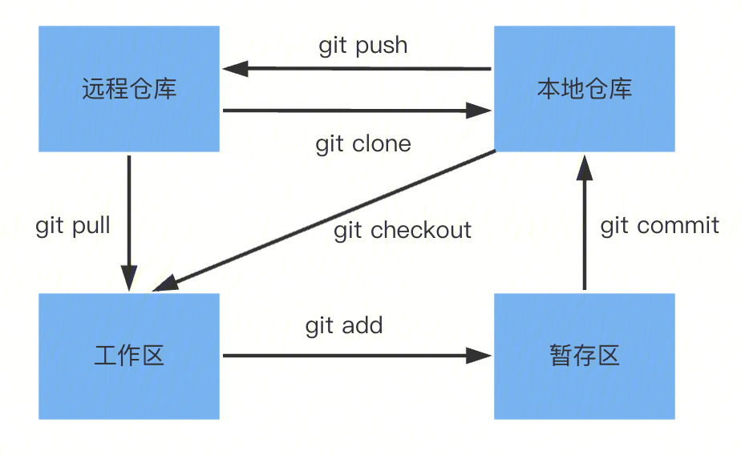

# git学习笔记
## git基础
### 前提
1、安装git

从官网安装，地址如下：
```bash
https://git-scm.com/downloads
```
2、查看git是否安装成功

```bash
$ git --version
```
3、设置用户信息

这就需要用到`git config`命令，配置信息

config的三个作用域

缺省等同于local，即直接使用`git config`
```bash
$ git config --local    //local只对某个仓库有效
$ git config --global   //global对当前用户所有仓库有效
$ git config --system   //system对系统所有登陆的用户有效
```
显示config的配置详情，加`--list`

配置global信息
```bash
$ git config --global user.name 'your name'
$ git config --global user.email 'your email'
```
### git常用操作



1、建立git仓库

两种场景：

(1)已有项目代码，使用git管理项目代码
```bash
$ cd 项目文件夹
$ git init
```
(2)新建项目
```bash
$ cd 工作空间
$ git init 项目名称（创建一个新的项目）
```
创建好的git仓库，包含`.git`文件，这是git项目的核心

2、提交

(1)从远程仓库克隆代码：`git clone <url>`

(2)将文件添加到暂存区：`git add`

```bash
$ git add <file_name>   //添加一个文件，直接加上文件名，支持多文件
$ git add <dir_name>    //添加整个目录（包含子目录）
$ git add .             //添加当前目录所有文件
```
(3)查看当前git的状态：`git status`，使用参数`-s`获得简洁的输出结果

(4)将暂存区内容提交到本地仓库：`git commit`

```bash
$ git commit -m <message>   //加上一些提交信息
$ git commit <file_name>    //提交某一个文件
$ git commit -a             //省去git add过程
```

3、文件操作

(1)重命名文件：`git mv <file_name> <new_file_name>`

(2)删除文件：`git rm`

删除工作区的文件，并且将这次删除放入暂存区

注意： 要删除的文件要和当前版本库文件的内容相同，否则需要加参数`-f`
```bash
$ git rm <file_name>  
```
如果文件已经`add`到暂存区，则必须强制删除，使用参数`-f`
```bash
$ git rm -f <file_name>
```
如果想把文件从暂存区域移除，但仍然希望保留在当前工作目录中，使用参数`--cached`
```bash
$ git rm --cached <file_name>
```
4、回退版本

`git reset [--soft | --mixed | --hard] [HEAD]`

(1)参数

`--soft`：参数用于回退到某个版本;

`--mixed`：默认，可以不加。用于重置暂存区的文件与上一次的提交(commit)保持一致，工作区文件内容保持不变;

`--hard`：撤销工作区中所有未提交的修改内容，将暂存区与工作区都回到上一次版本，并删除之前的所有信息提交。

注意：`--hard`要慎用，会删除工作区已修改，但未提交的内容

(2)HEAD

`[HEAD]`是指回退的版本，可以是具体的版本号，也可以是上一个版本等等

5、日志
一般使用`git log`查看历史提交记录，通过添加参数实现更多样的功能
```bash
$ git log --oneline  //查看历史记录的简洁版本
$ git log --graph    //图形化，清晰的看出分支、合并的变化
$ git log --n4       //最近的4个记录
$ git log --all      //查看所有分支的记录
```
6、远程仓库

(1)管理远程仓库：`git remote`

```bash
$ git remote -v                 //列出所有远程主机
$ git remote show <主机名>       //查看主机的详细信息，比如origin
$ git remote add <主机名> <网址>  //添加远程主机
$ git remote rm <主机名>         //删除远程主机
$ git remote rename <主机名> <新主机名> //命令用于远程主机的改名
```
(2)取回远程仓库的更改：`git fetch`

git用于多人协同开发，当远程仓库发生更新时，可以使用`git fetch`命令拉取所有远程代码;

```bash
$ git fetch <远程主机名> <分支名>  //取回特定分支的代码
```
一般结合`git merge origin/分支名`合并分支代码

(3)下载远程代码并合并：`git pull`

```bash
$ git pull <远程主机名> <远程分支名>:<本地分支名>  
```
这条命令相当于先`git fetch`，再`git merge`

(4)上传远程代码并合并：`git push`

```bash
$ git push <远程主机名> <本地分支名>:<远程分支名>
```

一般而言，本地分支和远程分支进行了绑定，直接`git pull`、`git push`即可;
## git分支管理

(1)创建分支

列出所有分支：`git branch`
创建分支：`git branch <branch_name>`
切换分支：`git checkout <branch_name>`
创建分支并切换到该分支：`git checkout -b <branch_name>`

(2)删除分支：`git branch -d <branch_name>`

(3)合并指定分支到当前分支：`git merge <branch_name>`

## git的复杂场景
## git与github
## git与gitLab
